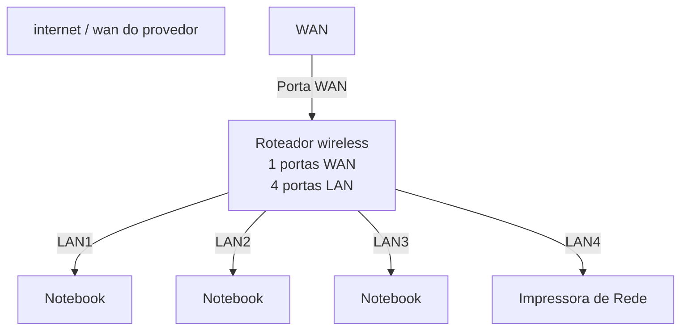
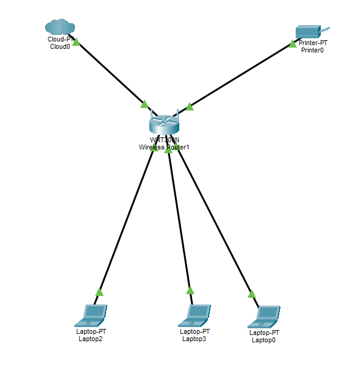

# laborátorio de redes 01 - projeto de rede local 
projeto desenvolvido na disciplina de redes de computadores no curso técnico de informantica do SENAC Tatuapé

aluno: Eduardo Mantovani

professor: josé de assis

Data: 09/03/2026

---
## 1. objetivo
implemntar uma rede local simples concetando 3 notebooks a um roteaodr wireless com switch
integrado a uma impressora de rede.

projeto será realizado em duas etapas:

1. simulação de rede no cisco packet tracer
2. implmentação de rede no laboratorio real

---

## 2. equipamentos utilizados neste laboratório

- 3 notebooks 
- 1 roteador wireless com 1 portan WAN e 4 portas LAN
- 1 impressora de rede
-   cabos de rede
 
  ---

## Topologia de rede
Diagrama lógico da rede utilizada neste laboratorio:

imagem da topologia utilizada no laboratório:

